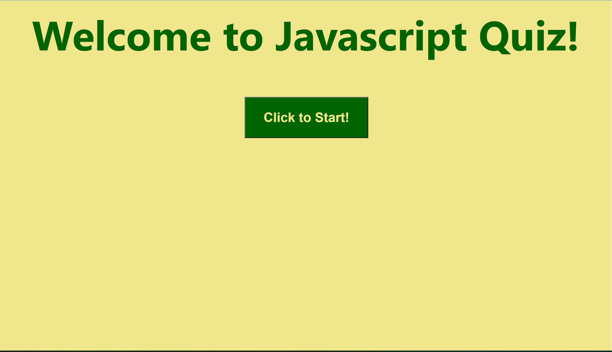
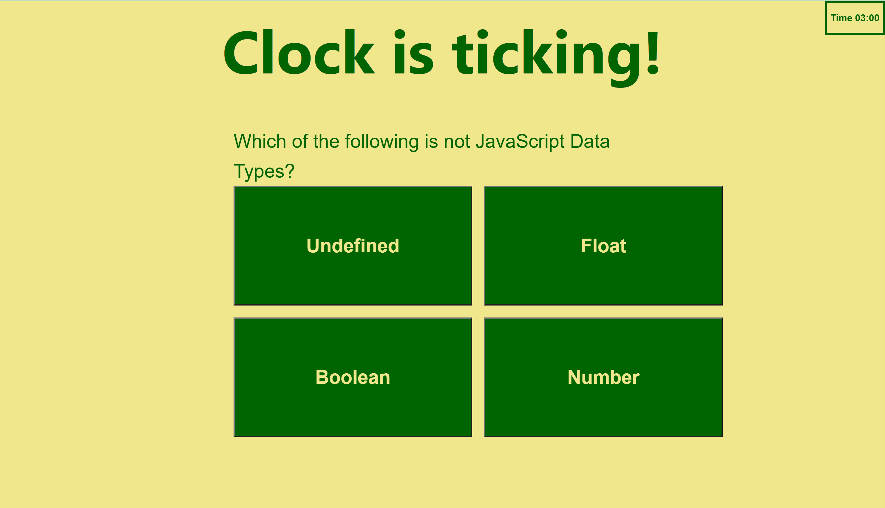
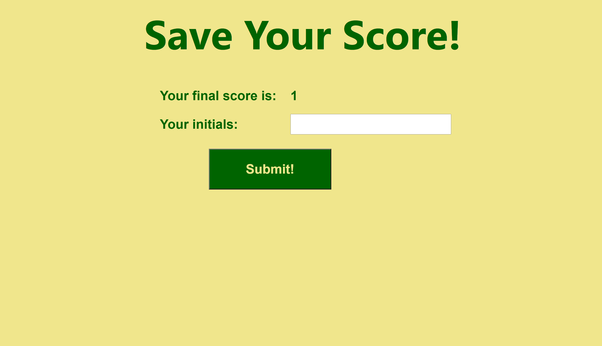
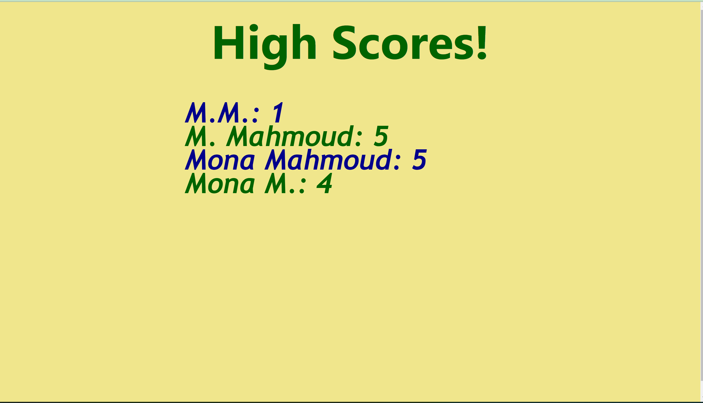

# Javascipt Quiz
## Description
This is a javascript quiz to help better understand javascript concepts and syntax. The quiz is timed and provides the option to store score at the end as well as displaying previously stored scores.

## Installation
Please visit the quiz page through the link: https://monamahmoud.github.io/JavascriptQuiz/   
The code for this project can be accessed through thr project Github repository here: https://github.com/MonaMahmoud/JavascriptQuiz

## Usage
Press the start button to start the quiz.   

After that answer the questions before the time runs out:  

At the end of the quiz you will see your score:  

After submitting your initials previously stored scores will be displayed:  

